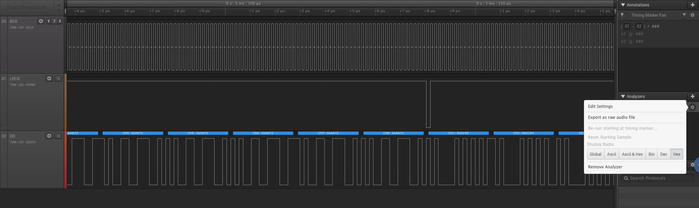

# Saleae TDM over I2S Analyzer

Saleae TDM over I2S Analyzer

## Getting Started

### Ubuntu

```
sudo apt install build-essential cmake
```

Building the analyzer:
```
mkdir build
cd build
cmake ..
cmake --build .
```

Brute-force deploy the analyzer:
```
cp -v Analyzers/libtdm_analyzer.so ~/Downloads/Logic\ 1.2.18\ \(64-bit\)/Analyzers/
```

## Example Screenshot



Note: can export as a raw audio data
